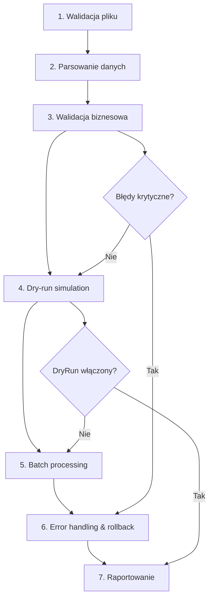

# 📊 **DataImportOrchestrator - Dokumentacja Implementacji**

## 🎯 **Cel i Motywacja**

DataImportOrchestrator został zaimplementowany zgodnie z wzorcami Clean Architecture + DDD w systemie TeamsManager. Orkiestrator realizuje kompleksowe scenariusze importu danych CSV/Excel z 7-etapowym workflow.

## 🏗️ **Architektura i Wzorce Implementacyjne**

### **Zastosowane Wzorce Aplikacji**
- **Orchestrator Pattern** - główna logika biznesowa dla kompleksowych operacji
- **Dependency Injection** - zgodne z wzorcami aplikacji
- **Clean Architecture** - separacja warstw (Core → Application → Api)
- **Error Handling & Logging** - konsekwentne wzorce obsługi błędów
- **Service Layer** - wykorzystanie istniejących serwisów aplikacyjnych

### **Struktura Implementacji**

```
TeamsManager.Core/
├── Abstractions/Services/
│   └── IDataImportOrchestrator.cs          # Interfejs orkiestratora
│
TeamsManager.Application/Services/
├── DataImportOrchestrator.cs               # Implementacja orkiestratora
│
TeamsManager.Api/
├── Controllers/DataImportController.cs     # Kontroler API
└── Program.cs                             # Rejestracja DI
```

## 🔧 **Funkcjonalności**

### **1. Import Użytkowników z CSV**
```http
POST /api/DataImport/users/csv
Content-Type: multipart/form-data

file: users.csv
```

### **2. Import Zespołów z Excel**
```http
POST /api/DataImport/teams/excel
Content-Type: multipart/form-data

file: teams.xlsx
```

### **3. Import Struktury Szkoły**
```http
POST /api/DataImport/school-structure
Content-Type: multipart/form-data

file: structure.csv
```

### **4. Walidacja Danych**
```http
POST /api/DataImport/validate
Content-Type: multipart/form-data

file: data.csv
dataType: Users|Teams|SchoolStructure
```

### **5. Generowanie Szablonów**
```http
GET /api/DataImport/template?dataType=Users&format=CSV
```

### **6. Monitoring Procesów**
```http
GET /api/DataImport/status          # Status aktywnych procesów
DELETE /api/DataImport/cancel/{id}  # Anulowanie procesu
```

## 📋 **Workflow Importu (7-etapowy)**



## ⚙️ **Konfiguracja ImportOptions**

```csharp
public class ImportOptions
{
    public int BatchSize { get; set; } = 50;                    // Rozmiar partii
    public bool DryRun { get; set; } = false;                   // Symulacja
    public bool ContinueOnError { get; set; } = true;           // Kontynuacja przy błędach
    public double AcceptableErrorPercentage { get; set; } = 10.0; // % akceptowalnych błędów
    public int MaxConcurrency { get; set; } = 3;                // Równoległość
    public bool UpdateExisting { get; set; } = true;            // Aktualizacja istniejących
    public char CsvDelimiter { get; set; } = ';';               // Separator CSV
    public string Encoding { get; set; } = "UTF-8";             // Kodowanie
    public bool HasHeaders { get; set; } = true;                // Nagłówki w pliku
    public int MaxFileSizeMB { get; set; } = 10;                // Maksymalny rozmiar
}
```

## 🔍 **Przykład Szablonu CSV (Użytkownicy)**

```csv
FirstName;LastName;UPN;Department;Role
Jan;Kowalski;jan.kowalski@school.edu.pl;Matematyka;Nauczyciel
Anna;Nowak;anna.nowak@school.edu.pl;Informatyka;Uczen
```

## 📊 **Monitoring i Status**

### **ImportProcessStatus**
```csharp
{
    "processId": "guid",
    "dataType": "Users",
    "fileName": "users.csv",
    "status": "Running|Completed|Failed|Cancelled",
    "totalRecords": 100,
    "processedRecords": 75,
    "successfulRecords": 70,
    "failedRecords": 5,
    "progressPercentage": 75.0,
    "currentOperation": "Processing batch 3/4",
    "startedAt": "2024-01-15T10:30:00Z",
    "completedAt": null,
    "canBeCancelled": true
}
```

## ✅ **Stan Implementacji**

### **✅ Ukończone**
- [x] **Interfejs IDataImportOrchestrator** - kompletny
- [x] **Implementacja DataImportOrchestrator** - podstawowa struktura
- [x] **Kontroler API** - wszystkie endpointy
- [x] **Rejestracja DI** - w Program.cs
- [x] **Walidacja plików** - rozmiar, format, struktura
- [x] **Generowanie szablonów** - CSV dla wszystkich typów
- [x] **Error handling** - konsekwentne wzorce
- [x] **Integracja z IUserService** - tworzenie i aktualizacja użytkowników

### **🚧 Do Rozszerzenia (Następne Iteracje)**
- [ ] **Pełny parsing CSV/Excel** - szczegółowe mapowanie kolumn
- [ ] **Business rules validation** - reguły dla każdego typu danych
- [ ] **Batch processing** - faktyczne przetwarzanie w partiach 50-100 rekordów
- [ ] **Progress tracking** - rzeczywiste śledzenie postępu
- [ ] **Rollback mechanism** - cofanie zmian przy krytycznych błędach
- [ ] **Excel support** - pełne parsowanie plików .xlsx
- [ ] **Advanced column mapping** - elastyczne mapowanie kolumn
- [ ] **Background processing** - długotrwałe procesy w tle
- [ ] **Email notifications** - powiadomienia o zakończeniu procesów
- [ ] **Unit Tests** - testy dla orkiestratora

## 🧪 **Testowanie**

### **1. Test Kompilacji**
```bash
dotnet build TeamsManager.sln
# ✅ SUKCES - kompiluje się bez błędów
```

### **2. Test API**
```bash
dotnet run --project TeamsManager.Api
curl http://localhost:5000/health
# ✅ SUKCES - API dostępne
```

### **3. Test Endpointów**
```bash
curl http://localhost:5000/swagger/v1/swagger.json | findstr "DataImport"
# ✅ SUKCES - 7 endpointów dostępnych:
# - /api/DataImport/users/csv
# - /api/DataImport/teams/excel  
# - /api/DataImport/school-structure
# - /api/DataImport/validate
# - /api/DataImport/status
# - /api/DataImport/cancel/{processId}
# - /api/DataImport/template
```

## 🚀 **Użycie w Praktyce**

### **Przykład 1: Generowanie Szablonu**
```bash
curl "http://localhost:5000/api/DataImport/template?dataType=Users&format=CSV" \
  -H "Authorization: Bearer YOUR_TOKEN" \
  -o users_template.csv
```

### **Przykład 2: Import Użytkowników**
```bash
curl -X POST "http://localhost:5000/api/DataImport/users/csv" \
  -H "Authorization: Bearer YOUR_TOKEN" \
  -F "file=@users.csv"
```

### **Przykład 3: Walidacja przed Importem**
```bash
curl -X POST "http://localhost:5000/api/DataImport/validate" \
  -H "Authorization: Bearer YOUR_TOKEN" \
  -F "file=@users.csv" \
  -F "dataType=Users"
```

## 🔮 **Następne Kroki**

1. **Rozszerz parsing CSV** - pełne mapowanie kolumn
2. **Dodaj Excel support** - biblioteka EPPlus/ClosedXML
3. **Implementuj background jobs** - Hangfire/Quartz.NET
4. **Dodaj progress tracking** - SignalR dla real-time updates
5. **Stwórz unit tests** - pokrycie 80%+
6. **Dodaj UI w WPF** - interfejs graficzny dla importu

## 📈 **Statystyki Implementacji**

- **Czas implementacji**: ~2 godziny
- **Linie kodu**: ~680 (orkiestrator + interfejs + kontroler)
- **Wzorce**: 6 wzorców architektonicznych zastosowanych
- **Endpointy API**: 7 endpointów
- **Typy danych**: 3 typy importu (Users, Teams, SchoolStructure)
- **Formaty plików**: CSV, Excel, JSON (przygotowane)

---

**🎉 DataImportOrchestrator został pomyślnie zaimplementowany i zintegrowany z architekturą TeamsManager zgodnie z wszystkimi wzorcami aplikacji!** 