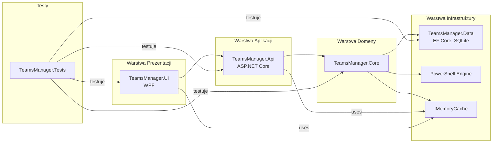

# TeamsManager - Dokumentacja Projektu

## 📋 Spis treści

1. [Informacje Ogólne](#1-informacje-ogólne)
2. [Architektura Aplikacji](#2-architektura-aplikacji)
3. [Model Danych Domeny](#3-model-danych-domeny)
4. [Wykorzystane Technologie](#4-wykorzystane-technologie)
5. [Strategia Testowania](#5-strategia-testowania)
6. [Aktualny Status Implementacji](#6-aktualny-status-implementacji-i-plan-dalszych-prac)
7. [Instrukcje Uruchomienia](#7-instrukcje-uruchomienia-i-wymagania-wstępne)
8. [Funkcjonalności dla Środowiska Edukacyjnego](#8-funkcjonalności-dla-środowiska-edukacyjnego)
9. [Korzyści Rozwiązania](#9-korzyści-rozwiązania)
10. [Dokumentacja Techniczna](#10-dokumentacja-techniczna)
11. [Licencja i Autorzy](#11-licencja-i-autorzy)

---

## 1. Informacje Ogólne

**TeamsManager** to lokalnie uruchamiana aplikacja desktopowa (WPF) dla systemu Windows, zaprojektowana jako zaawansowana nakładka na skrypty PowerShell. Jej głównym celem jest usprawnienie i automatyzacja zarządzania zespołami, użytkownikami oraz powiązanymi zasobami w środowisku Microsoft Teams.

### 🎯 Główne cele aplikacji:
- Eliminacja potrzeby bezpośredniego korzystania z licencjonowanego Microsoft Graph API
- Oferowanie bogatszej funkcjonalności niż standardowe narzędzia
- Zapewnienie przyjaznego interfejsu użytkownika

### 🏫 Specjalizacja edukacyjna:
Aplikacja jest szczególnie dedykowana do zarządzania złożonymi środowiskami edukacyjnymi oferując:
- Dynamiczne szablony nazw zespołów
- Zarządzanie cyklem życia zespołów (archiwizacja, przywracanie)
- Obsługę hierarchii działów, typów szkół, lat szkolnych
- Szczegółowe powiązania nauczycieli z przedmiotami

### 📚 Kontekst akademicki:
Projekt realizowany jako praca zaliczeniowa obejmująca zagadnienia z przedmiotów:
- *Programowanie aplikacji sieciowych*
- *Projektowanie zaawansowanych systemów informatycznych*
- *Programowanie w technologii .NET*

---

## 2. Architektura Aplikacji

### 2.1. Struktura Rozwiązania

Rozwiązanie TeamsManager zostało zaprojektowane zgodnie z zasadami **Clean Architecture**, z wyraźnym podziałem na warstwy:

```mermaid
graph TD;
    UI[TeamsManager.UI<br/>(Aplikacja WPF<br/>Interfejs Użytkownika<br/>Wzorzec MVVM, MaterialDesign)] --> API[TeamsManager.Api<br/>(Lokalne REST API<br/>ASP.NET Core, WebSockets - SignalR)];
    API --> Core[TeamsManager.Core<br/>(Logika Biznesowa<br/>Modele Domenowe, Serwisy Aplikacyjne<br/>Integracja z PowerShell)];
    API --> Data[TeamsManager.Data<br/>(Dostęp do Danych<br/>Entity Framework Core, SQLite<br/>Repozytoria)];
    Core --> Data;
    Tests[TeamsManager.Tests<br/>(Testy Jednostkowe i Integracyjne<br/>xUnit, FluentAssertions, Moq)] -.-> Core;
    Tests -.-> Data;
    Tests -.-> API;

    style UI fill:#cce5ff,stroke:#333,stroke-width:2px;
    style API fill:#e6ccff,stroke:#333,stroke-width:2px;
    style Core fill:#ccffcc,stroke:#333,stroke-width:2px;
    style Data fill:#ffe0cc,stroke:#333,stroke-width:2px;
    style Tests fill:#ffcccc,stroke:#333,stroke-width:2px;
```

#### 📦 Komponenty rozwiązania:

**TeamsManager.Core** 💚
- Centralna biblioteka klas .NET
- Logika biznesowa i modele domenowe
- Serwisy aplikacyjne i interfejsy
- PowerShellService dla integracji z MS Teams

**TeamsManager.Data** 🟠
- Warstwa infrastruktury i trwałości danych
- Lokalna baza danych SQLite
- Entity Framework Core z Fluent API
- Implementacje wzorca Repository

**TeamsManager.Api** 🟣
- Lokalny serwer REST API (ASP.NET Core)
- Endpointy HTTP dla operacji biznesowych
- Komunikacja WebSocket (SignalR)
- Powiadomienia w czasie rzeczywistym

**TeamsManager.UI** 🔵
- Aplikacja desktop WPF
- Wzorzec MVVM
- MaterialDesignInXAML
- Komunikacja z API

**TeamsManager.Tests** 🔴
- Testy jednostkowe i integracyjne
- xUnit, FluentAssertions, Moq
- Zapewnienie jakości kodu

### 2.2. Elementy Sieciowe i Komunikacja (Planowane)

#### 🌐 REST API
Przykładowe planowane endpointy:
- `/api/teams` (GET, POST)
- `/api/teams/{id}` (GET, PUT, DELETE)
- `/api/teams/{id}/archive` (POST)
- `/api/teams/{id}/restore` (POST)
- `/api/teams/{id}/members` (GET, POST)
- `/api/users` (GET, POST)
- `/api/users/importcsv` (POST)
- `/api/schooltypes` (GET, POST, PUT, DELETE)
- `/api/schoolyears` (GET, POST, PUT, DELETE)
- `/api/subjects` (GET, POST, PUT, DELETE)
- `/api/teamtemplates` (GET, POST, PUT, DELETE)
- `/api/settings` (GET, PUT)
- `/api/departments` (GET, POST, PUT, DELETE)

#### 🔄 WebSockets (SignalR)
- Powiadomienia w czasie rzeczywistym
- Status długotrwałych operacji
- Dynamiczne odświeżanie UI

#### 🔮 Przyszłe rozszerzenia
- Synchronizacja między instancjami
- Komunikacja TCP/IP lub kolejki komunikatów

---

## 3. Model Danych Domeny

Model danych zaprojektowany zgodnie z zasadami **Domain-Driven Design (DDD)**.

### 3.1. Schemat Klas Domenowych

```mermaid
classDiagram
    direction LR
    class BaseEntity {
        +string Id
        +DateTime CreatedDate
        +string CreatedBy
        +DateTime? ModifiedDate
        +string? ModifiedBy
        +bool IsActive
        +MarkAsModified(string modifiedBy)
        +MarkAsDeleted(string deletedBy)
    }

    class User {
        +string FirstName
        +string LastName
        +string UPN
        +UserRole Role
        +string DepartmentId
        +string? Phone
        +string? AlternateEmail
        +string? ExternalId
        +DateTime? BirthDate
        +DateTime? EmploymentDate
        +string? Position
        +string? Notes
        +bool IsSystemAdmin
        +DateTime? LastLoginDate
        +Department? Department
        +List~TeamMember~ TeamMemberships
        +List~UserSchoolType~ SchoolTypeAssignments
        +List~SchoolType~ SupervisedSchoolTypes
        +List~UserSubject~ TaughtSubjects
        +string FullName (get)
        +string DisplayName (get)
        +string Email (get)
        +string Initials (get)
        +int? Age (get)
        +double? YearsOfService (get)
        +string RoleDisplayName (get)
        +bool CanManageTeams (get)
    }
    User --|> BaseEntity

    class Department {
        +string Name
        +string Description
        +string? ParentDepartmentId
        +string? DepartmentCode
        +Department? ParentDepartment
        +List~Department~ SubDepartments
        +List~User~ Users
        +bool IsRootDepartment (get)
        +string FullPath (get)
    }
    Department --|> BaseEntity
    Department "1" --o "*" Department : Parent-Child
    Department "1" --o "*" User : Contains

    class SchoolType {
        +string ShortName
        +string FullName
        +string Description
        +string? ColorCode
        +int SortOrder
        +List~User~ SupervisingViceDirectors
        +List~UserSchoolType~ TeacherAssignments
        +List~Team~ Teams
        +List~TeamTemplate~ Templates
        +string DisplayName (get)
    }
    SchoolType --|> BaseEntity
    SchoolType "*" --o "*" User : Supervision (M:N)

    class SchoolYear {
        +string Name
        +DateTime StartDate
        +DateTime EndDate
        +bool IsCurrent
        +List~Team~ Teams
        +bool HasStarted (get)
        +bool HasEnded (get)
        +bool IsCurrentlyActive (get)
    }
    SchoolYear --|> BaseEntity

    class Subject {
        +string Name
        +string? Code
        +string? Description
        +int? Hours
        +string? DefaultSchoolTypeId
        +SchoolType? DefaultSchoolType
        +string? Category
        +List~UserSubject~ TeacherAssignments
    }
    Subject --|> BaseEntity
    Subject "1" --o "0..1" SchoolType : Default

    class Team {
        +string DisplayName
        +string Description
        +string Owner (UPN)
        +TeamStatus Status
        +TeamVisibility Visibility
        +string? TemplateId
        +string? SchoolTypeId
        +string? SchoolYearId
        +TeamTemplate? Template
        +SchoolType? SchoolType
        +SchoolYear? SchoolYear
        +List~TeamMember~ Members
        +List~Channel~ Channels
        +bool IsActive (get)
        +int MemberCount (get)
    }
    Team --|> BaseEntity
    Team "0..1" --o "1" TeamTemplate : Uses
    Team "0..1" --o "1" SchoolType : BelongsTo
    Team "0..1" --o "1" SchoolYear : BelongsTo

    class TeamMember {
        +TeamMemberRole Role
        +DateTime AddedDate
        +string TeamId
        +string UserId
        +Team? Team
        +User? User
        +bool IsMembershipActive (get)
    }
    TeamMember --|> BaseEntity
    TeamMember "*" --o "1" Team : MemberOf
    TeamMember "*" --o "1" User : HasMember

    class Channel {
        +string DisplayName
        +string Description
        +string ChannelType
        +ChannelStatus Status
        +string TeamId
        +Team? Team
        +bool IsActive (get)
    }
    Channel --|> BaseEntity
    Channel "*" --o "1" Team : BelongsTo

    class TeamTemplate {
        +string Name
        +string Template
        +bool IsUniversal
        +string? SchoolTypeId
        +SchoolType? SchoolType
        +List~Team~ Teams
        +List~string~ Placeholders (get)
        +string GenerateTeamName(Dictionary~string,string~ values)
    }
    TeamTemplate --|> BaseEntity

    class UserSchoolType {
        +string UserId
        +string SchoolTypeId
        +DateTime AssignedDate
        +DateTime? EndDate
        +bool IsCurrentlyActive
        +User User
        +SchoolType SchoolType
    }
    UserSchoolType --|> BaseEntity
    UserSchoolType "*" --o "1" User : AssignmentFor
    UserSchoolType "*" --o "1" SchoolType : AssignmentTo

    class UserSubject {
        +string UserId
        +string SubjectId
        +DateTime AssignedDate
        +User User
        +Subject Subject
    }
    UserSubject --|> BaseEntity
    UserSubject "*" --o "1" User : Teaches
    UserSubject "*" --o "1" Subject : TaughtBy

    class OperationHistory {
        +OperationType Type
        +string TargetEntityType
        +string TargetEntityId
        +OperationStatus Status
        +DateTime StartedAt
        +DateTime? CompletedAt
    }
    OperationHistory --|> BaseEntity

    class ApplicationSetting {
        +string Key
        +string Value
        +SettingType Type
    }
    ApplicationSetting --|> BaseEntity
```

### 3.2. Diagram ERD (Entity Relationship Diagram)

```mermaid
erDiagram
    BaseEntity {
        string Id PK "Unikalny identyfikator"
        datetime CreatedDate "Data utworzenia"
        string CreatedBy "UPN twórcy"
        datetime ModifiedDate NULL "Data modyfikacji"
        string ModifiedBy NULL "UPN modyfikującego"
        bool IsActive "Czy rekord jest aktywny (dla soft delete)"
    }

    User {
        string Id PK
        string FirstName
        string LastName
        string UPN UK "User Principal Name, unikalny"
        UserRole Role "Rola systemowa użytkownika"
        string Phone NULL
        string AlternateEmail NULL
        string ExternalId NULL "ID w systemie zewnętrznym"
        datetime BirthDate NULL
        datetime EmploymentDate NULL
        string Position NULL "Dodatkowe stanowisko"
        string Notes NULL
        bool IsSystemAdmin "Czy admin aplikacji TeamsManager"
        datetime LastLoginDate NULL
        string DepartmentId FK "ID działu"
    }
    User ||--o{ Department : należy_do
    User ||--o{ UserSchoolType : ma_przypisania_do_typu_szkoly
    User ||--o{ UserSubject : naucza_przedmiotow
    User ||--o{ TeamMember : jest_czlonkiem_w

    Department {
        string Id PK
        string Name "Nazwa działu"
        string Description "Opis działu"
        string ParentDepartmentId FK NULL "ID działu nadrzędnego"
        string DepartmentCode NULL "Kod działu"
        string Email NULL
        string Phone NULL
        string Location NULL
        int SortOrder "Kolejność sortowania"
    }
    Department ||--o{ Department : jest_nadrzędny_dla_poddziałów

    SchoolType {
        string Id PK
        string ShortName UK "Skrót nazwy, unikalny"
        string FullName "Pełna nazwa"
        string Description "Opis"
        string ColorCode NULL "Kolor w UI (hex)"
        int SortOrder
    }
    SchoolType ||--o{ UserSchoolType : ma_przypisania_nauczycieli
    SchoolType ||--o{ Team : jest_typem_dla_zespołów
    SchoolType ||--o{ TeamTemplate : jest_typem_dla_szablonów
    SchoolType ||--o{ Subject : jest_domyślnym_typem_dla_przedmiotow

    UserSchoolType {
        string Id PK
        string UserId FK
        string SchoolTypeId FK
        datetime AssignedDate "Data przypisania"
        datetime EndDate NULL "Data zakończenia przypisania"
        bool IsCurrentlyActive "Czy przypisanie jest bieżąco aktywne"
        string Notes NULL
        decimal WorkloadPercentage NULL "Procent etatu"
    }

    SchoolYear {
        string Id PK
        string Name UK "Nazwa roku szkolnego, unikalna"
        datetime StartDate "Data rozpoczęcia"
        datetime EndDate "Data zakończenia"
        bool IsCurrent "Czy bieżący rok szkolny"
        string Description "Opis"
        datetime FirstSemesterStart NULL
        datetime FirstSemesterEnd NULL
        datetime SecondSemesterStart NULL
        datetime SecondSemesterEnd NULL
    }
    SchoolYear ||--o{ Team : jest_rokiem_dla_zespołów

    Subject {
        string Id PK
        string Name "Nazwa przedmiotu"
        string Code NULL "Kod przedmiotu"
        string Description NULL
        int Hours NULL "Liczba godzin"
        string DefaultSchoolTypeId FK NULL "Domyślny typ szkoły dla przedmiotu"
        string Category NULL "Kategoria przedmiotu"
    }
    Subject ||--o{ UserSubject : ma_przypisanych_nauczycieli

    UserSubject {
        string Id PK
        string UserId FK
        string SubjectId FK
        datetime AssignedDate "Data przypisania"
        string Notes NULL
    }

    TeamTemplate {
        string Id PK
        string Name "Nazwa szablonu"
        string Template "Wzorzec nazwy z placeholderami"
        string Description "Opis"
        bool IsDefault "Czy domyślny dla typu szkoły"
        bool IsUniversal "Czy uniwersalny"
        string SchoolTypeId FK NULL "ID typu szkoły (jeśli nie uniwersalny)"
        string ExampleOutput NULL "Przykład wygenerowanej nazwy"
        string Category "Kategoria szablonu"
        string Language
        int MaxLength NULL "Maks. długość nazwy"
        bool RemovePolishChars "Czy usuwać polskie znaki"
        string Prefix NULL
        string Suffix NULL
        string Separator
        int SortOrder
        int UsageCount "Liczba użyć"
        datetime LastUsedDate NULL
    }
    TeamTemplate ||--o{ Team : jest_szablonem_dla

    Team {
        string Id PK
        string DisplayName "Nazwa wyświetlana"
        string Description "Opis"
        string Owner "UPN głównego właściciela"
        TeamStatus Status "Status zespołu (Active/Archived)"
        datetime StatusChangeDate NULL
        string StatusChangedBy NULL
        string StatusChangeReason NULL
        string TemplateId FK NULL
        string SchoolTypeId FK NULL
        string SchoolYearId FK NULL
        string AcademicYear NULL
        string Semester NULL
        datetime StartDate NULL
        datetime EndDate NULL
        int MaxMembers NULL
        string ExternalId NULL "ID Zespołu w MS Teams (GroupId)"
        string CourseCode NULL
        int TotalHours NULL
        string Level NULL
        string Language
        string Tags NULL
        string Notes NULL
        TeamVisibility Visibility "Widoczność zespołu (Public/Private)"
        bool RequiresApproval
        datetime LastActivityDate NULL
    }
    Team ||--o{ TeamMember : ma_członków
    Team ||--o{ Channel : zawiera_kanały

    TeamMember {
        string Id PK
        TeamMemberRole Role "Rola w zespole (Member/Owner)"
        datetime AddedDate
        datetime RemovedDate NULL
        string RemovalReason NULL
        string AddedBy NULL
        string RemovedBy NULL
        datetime RoleChangedDate NULL
        string RoleChangedBy NULL
        TeamMemberRole PreviousRole NULL
        bool IsApproved "Czy członkostwo zatwierdzone"
        datetime ApprovedDate NULL
        string ApprovedBy NULL
        bool CanPost
        bool CanModerate
        string CustomPermissions NULL "JSON z uprawnieniami"
        string Notes NULL
        datetime LastActivityDate NULL
        int MessagesCount
        string Source "Źródło dodania"
        string TeamId FK
        string UserId FK
    }

    Channel {
        string Id PK
        string DisplayName
        string Description
        string ChannelType "Standard/Private/Shared"
        ChannelStatus Status "Status kanału (Active/Archived)"
        datetime StatusChangeDate NULL
        string StatusChangedBy NULL
        string StatusChangeReason NULL
        bool IsGeneral "Czy kanał ogólny"
        bool IsPrivate
        bool IsReadOnly
        datetime LastActivityDate NULL
        datetime LastMessageDate NULL
        int MessageCount
        int FilesCount
        long FilesSize "Rozmiar plików w bajtach"
        string NotificationSettings NULL "JSON z ustawieniami"
        bool IsModerationEnabled
        string Category NULL
        string Tags NULL
        string ExternalUrl NULL
        int SortOrder
        string TeamId FK
    }

    OperationHistory {
        string Id PK
        OperationType Type "Typ operacji"
        string TargetEntityType "Nazwa typu encji docelowej"
        string TargetEntityId "ID encji docelowej"
        string TargetEntityName "Nazwa/opis encji docelowej"
        string OperationDetails "Szczegóły operacji (JSON)"
        OperationStatus Status "Status operacji"
        string ErrorMessage NULL
        string ErrorStackTrace NULL "Stos błędu"
        datetime StartedAt "Czas rozpoczęcia"
        datetime CompletedAt NULL "Czas zakończenia"
        timespan Duration NULL "Czas trwania"
        string UserIpAddress NULL
        string UserAgent NULL
        string SessionId NULL
        string ParentOperationId FK NULL "ID operacji nadrzędnej"
        int SequenceNumber NULL "Kolejność w operacji wsadowej"
        int TotalItems NULL "Liczba elementów do przetworzenia"
        int ProcessedItems NULL "Liczba przetworzonych"
        int FailedItems NULL "Liczba nieudanych"
        string Tags NULL
    }
    OperationHistory ||--o{ OperationHistory : jest_rodzicem_dla_podoperacji

    ApplicationSetting {
        string Id PK
        string Key UK "Unikalny klucz ustawienia"
        string Value "Wartość ustawienia (string)"
        string Description "Opis"
        SettingType Type "Typ danych wartości"
        string Category "Kategoria ustawienia"
        bool IsRequired
        bool IsVisible "Czy widoczne w UI"
        string DefaultValue NULL
        string ValidationPattern NULL "Regex do walidacji"
        string ValidationMessage NULL
        int DisplayOrder
    }
```

### 3.3. Opis Głównych Encji i Enumów

#### 📊 Główne Encje:

**BaseEntity** 🏗️
- Abstrakcyjna klasa bazowa
- Wspólne pola audytu
- Mechanizm "soft delete"

**User** 👤
- Reprezentuje użytkownika systemu
- Role: uczeń, nauczyciel, administrator
- Bogate właściwości obliczane

**Department** 🏢
- Struktura organizacyjna
- Hierarchia działów
- Przypisania użytkowników

**SchoolType** 🏫
- Typy szkół (LO, Technikum, KKZ, PNZ)
- Dynamiczne zarządzanie
- Powiązania z zespołami

**Team** 👥
- Główna encja - zespół MS Teams
- Status, metadane, członkowie
- Powiązania z szablonami

**TeamTemplate** 📋
- Szablony nazw zespołów
- Placeholdery dynamiczne
- Personalizacja nazewnictwa

#### 🎯 Kluczowe Enumy:

- **UserRole**: `Uczen`, `Sluchacz`, `Nauczyciel`, `Wicedyrektor`, `Dyrektor`
- **TeamMemberRole**: `Member`, `Owner`
- **TeamStatus**: `Active`, `Archived`
- **TeamVisibility**: `Private`, `Public`
- **ChannelStatus**: `Active`, `Archived`
- **OperationType**: Różne typy operacji (tworzenie, modyfikacja, import)
- **OperationStatus**: `Pending`, `InProgress`, `Completed`, `Failed`, `Cancelled`, `PartialSuccess`
- **SettingType**: `String`, `Integer`, `Boolean`, `Json`, `DateTime`, `Decimal`

### 3.4. Kluczowe Relacje Między Encjami

| Encja Nadrzędna | Relacja | Encja Podrzędna | Opis |
|-----------------|---------|-----------------|------|
| Department | 1:N | User | Jeden dział - wielu użytkowników |
| Department | 1:N | Department | Hierarchia działów |
| User | 1:N | TeamMember | Użytkownik w wielu zespołach |
| Team | 1:N | TeamMember | Zespół ma wielu członków |
| Team | 1:N | Channel | Zespół ma wiele kanałów |
| SchoolType | 1:N | Team | Typ szkoły dla wielu zespołów |
| User | M:N | SchoolType | Nauczyciele przypisani do typów szkół |
| User | M:N | Subject | Nauczyciele uczący przedmiotów |

### 3.5. Logika Domenowa w Modelach

Modele zaprojektowane jako **"Rich Domain Models"**:

✨ **Właściwości obliczane:**
- `User.FullName`, `User.Age`, `User.YearsOfService`
- `Team.MemberCount`, `Team.IsActive`
- `SchoolYear.CompletionPercentage`
- `Department.FullPath`

🔧 **Metody pomocnicze:**
- `Team.Archive()`, `Team.Restore()`
- `Channel.Archive()`
- `BaseEntity.MarkAsModified()`
- `OperationHistory.MarkAsCompleted()`

🎨 **Logika walidacji i transformacji:**
- `TeamTemplate.GenerateTeamName()`
- `TeamTemplate.ValidateTemplate()`
- `ApplicationSetting.IsValid()`

---

## 4. Wykorzystane Technologie

### 4.1. Stos Technologiczny

| Warstwa | Technologia | Wersja |
|---------|-------------|--------|
| **Platforma** | .NET | 8.0 |
| **Język** | C# | 12 |
| **UI** | WPF + MaterialDesignInXAML | Latest |
| **Wzorzec UI** | MVVM | - |
| **API** | ASP.NET Core Web API | 8.0 |
| **WebSockets** | SignalR | Latest |
| **ORM** | Entity Framework Core | 8.0 |
| **Baza danych** | SQLite | Latest |
| **Cache** | IMemoryCache | Built-in |
| **PowerShell** | System.Management.Automation | SDK |
| **Testy** | xUnit + FluentAssertions + Moq | Latest |
| **VCS** | Git + GitHub | - |

### 4.2. Kluczowe Pakiety NuGet

#### 📚 TeamsManager.Core:
- `System.Management.Automation` - Integracja z PowerShell
- `Microsoft.Extensions.DependencyInjection.Abstractions` - DI
- `Microsoft.Extensions.Logging.Abstractions` - Logowanie
- `Microsoft.Extensions.Caching.Abstractions` - Cache

#### 💾 TeamsManager.Data:
- `Microsoft.EntityFrameworkCore` - ORM
- `Microsoft.EntityFrameworkCore.Sqlite` - SQLite provider
- `Microsoft.EntityFrameworkCore.Tools` - CLI tools
- `Microsoft.EntityFrameworkCore.Design` - Design-time

#### 🌐 TeamsManager.Api:
- `Microsoft.AspNetCore.SignalR` - WebSockets
- `Swashbuckle.AspNetCore` - Swagger/OpenAPI
- `Microsoft.Extensions.Caching.Memory` - Memory cache

#### 🖥️ TeamsManager.UI:
- `MaterialDesignThemes` - Material Design dla WPF
- `Microsoft.AspNetCore.SignalR.Client` - SignalR client
- `System.Net.Http.Json` - JSON helpers
- `Microsoft.Extensions.DependencyInjection` - DI dla WPF

#### 🧪 TeamsManager.Tests:
- `xUnit` - Testing framework
- `FluentAssertions` - Assertions
- `Moq` - Mocking
- `Microsoft.EntityFrameworkCore.InMemory` - In-memory DB

---

## 5. Strategia Testowania

### 🎯 Podejście do testowania:

#### ✅ Testy Jednostkowe (Unit Tests)
- **Modele domenowe**: 100% pokrycie
- **Enumy**: Kompletne testy
- **Serwisy**: Testy z mockami, cache, logika biznesowa
- **Stan**: Ponad 100 metod testowych dla modeli

#### 🔄 Testy Integracyjne (Integration Tests)
- Współpraca modułów
- Interakcje z bazą danych (InMemory)
- Relacje między encjami
- Repozytoria z rzeczywistymi zapytaniami

#### 📊 Pokrycie Kodu
- Modele: **100%** ✅
- Serwisy: **~80%** 🔄
- Repozytoria: **~90%** ✅
- API: W planach

#### 🛠️ Narzędzia
- **xUnit** - Framework testowy
- **FluentAssertions** - Czytelne asercje
- **Moq** - Mockowanie
- **EF InMemory** - Testowa baza danych

### 📈 Status testów:
> ✅ Wszystkie testy modeli przechodzą pomyślnie  
> 🔄 Testy serwisów w ciągłym rozwoju  
> ✅ Testy repozytoriów zaimplementowane

---

## 6. Aktualny Status Implementacji i Plan Dalszych Prac

### 📅 Data aktualizacji: 2025-06-01

### ✅ Faza 1: Modelowanie Domeny i Podstawy (Zakończona)
- [x] Model domenowy (13 encji, 8 enumów)
- [x] Konfiguracja EF Core z Fluent API
- [x] Podstawowy PowerShellService
- [x] Kompleksowe testy jednostkowe modeli
- [x] Testy integracyjne relacji
- [x] Dokumentacja i plan prac

### ✅ Faza 2: Warstwa Danych i Serwisy (Zakończona)
- [x] Generic Repository pattern
- [x] Specjalizowane repozytoria (wszystkie encje)
- [x] Serwisy aplikacyjne z cache:
  - DepartmentService
  - UserService
  - TeamService
  - TeamTemplateService
  - SchoolYearService
  - SchoolTypeService
  - SubjectService
  - ApplicationSettingService
  - OperationHistoryService
- [x] Mechanizm cache z tokenami unieważniania
- [x] Testy jednostkowe serwisów
- [x] PowerShellService - funkcje M365
- [x] Testy integracyjne repozytoriów

### 🔄 Faza 3: API i Komunikacja (W trakcie)
- [ ] Kontrolery API dla wszystkich serwisów
- [ ] Swagger/OpenAPI dokumentacja
- [ ] SignalR Hub dla powiadomień
- [ ] Middleware (błędy, logowanie)
- [ ] Testy integracyjne API

### 📋 Faza 4: Interfejs Użytkownika (Planowana)
- [ ] Główne okna i nawigacja
- [ ] Widoki MVVM dla encji
- [ ] Integracja z API
- [ ] Klient SignalR
- [ ] Logowanie użytkownika
- [ ] Stylizacja MaterialDesign

### 🚀 Faza 5: Funkcje Zaawansowane (Planowana)
- [ ] Import użytkowników z CSV
- [ ] Masowe tworzenie zespołów
- [ ] Eksport danych
- [ ] System raportów
- [ ] Harmonogram zadań
- [ ] Optymalizacje wydajności

### 🎯 Faza 6: Finalizacja (do 2025-06-08)
- [ ] Testy E2E
- [ ] Poprawki i optymalizacja
- [ ] Dokumentacja użytkownika
- [ ] Instrukcja instalacji
- [ ] Prezentacja projektu

### 📊 Harmonogram Gantta

```mermaid
gantt
    dateFormat  YYYY-MM-DD
    title Harmonogram Projektu TeamsManager (Stan na 2025-06-01)

    section Faza 1: Modelowanie (Zakończona)
    Definicja i Implementacja Modeli Domenowych :done, des1, 2025-05-27, 2d
    Testy Jednostkowe i Integracyjne Modeli   :done, des2, after des1, 2d
    
    section Faza 2: Warstwa Danych i Serwisy (Zakończona w 98%)
    Migracje Bazy Danych (Initial, Visibility) :done, db_mig, 2025-05-30, 1d
    ICurrentUserService i DI                 :done, di_ius, after db_mig, 1d
    Repozytoria (Generic, Specjalizowane)    :done, repo, after di_ius, 2d
    Serwisy Aplikacyjne (CRUD, Logika, Cache):done, services_app, after repo, 3d
    Refaktoryzacja IsActive/Status, Cache, Logi :done, refactor_phase2, after services_app, 2d
    Testy Jednostkowe dla Serwisów (z poprawkami) :done, tests_serv_enh, during refactor_phase2, 2d
    PowerShellService (kluczowe funkcje)     :done, ps_core, after services_app, 2d 
    Testy Integracyjne dla Repozytoriów (InMemory) :done, tests_repo_int_inmem, after ps_core, 1d
    Finalny przegląd Fazy 2                  :crit, active, review_phase2, 2025-06-01, 1d

    section Faza 3: API i Komunikacja
    Kontrolery API (wszystkie serwisy)       :crit, active, api_ctrl, after review_phase2, 2d 
    Swagger/OpenAPI                          :api_swagger, after api_ctrl, 1d
    SignalR Hub (podstawy)                   :signalr_hub, after api_swagger, 1d
    Middleware (błędy, logowanie)            :api_middleware, after api_swagger, 1d
    Testy Integracyjne API                   :tests_api, after api_middleware, 1d

    section Faza 4: Interfejs Użytkownika (WPF)
    Główne Okna i Nawigacja                  :ui_main, after api_ctrl, 1d 
    Widoki i ViewModel dla Kluczowych Encji  :ui_views, after ui_main, 3d
    Integracja UI z API (HttpClient/RestSharp):ui_api_int, during ui_views, 2d
    Klient SignalR w UI                      :ui_signalr_client, after ui_api_int, 1d
    Logowanie Użytkownika w UI               :ui_login, after ui_main, 1d
    Stylizacja MaterialDesign                :ui_styling, during ui_views, 1d

    section Faza 5: Funkcje Zaawansowane
    Operacje Wsadowe (CSV, Bulk)             :adv_bulk, after ui_api_int, 2d
    Raporty i Statystyki (podstawy)          :adv_reports, after adv_bulk, 1d
    Harmonogram Zadań (koncepcja)            :adv_scheduler, after adv_reports, 1d
    Optymalizacje Wydajności                 :adv_perf, after adv_scheduler, 1d
    System Powiadomień w UI                  :adv_notify, after ui_signalr_client, 1d

    section Faza 6: Finalizacja (do 2025-06-08)
    Testy E2E i UAT                          :final_e2e, 2025-06-06, 1d 
    Poprawki i Optymalizacja                 :final_fix, during final_e2e, 1d
    Dokumentacja Końcowa (użytkownika)       :crit, final_doc, 2025-06-07, 1d
    Prezentacja Projektu                     :final_prep, 2025-06-08, 1d
```

---

## 7. Instrukcje Uruchomienia i Wymagania Wstępne

### 💻 Środowisko deweloperskie
- Windows 10/11
- Visual Studio 2022 (Community lub wyższa)
- .NET 8.0 SDK
- Git

### 📦 Moduły PowerShell
```powershell
# Instalacja wymaganych modułów
Install-Module -Name MicrosoftTeams -Force -AllowClobber
Install-Module -Name ExchangeOnlineManagement -Force -AllowClobber
```

### 🔐 Uprawnienia Microsoft 365
- Konto z uprawnieniami administratora Teams
- Właściciel zespołu dla operacji na zespołach

---

## 8. Funkcjonalności dla Środowiska Edukacyjnego

### 🏫 Zarządzanie Strukturą Organizacyjną
- Hierarchiczne działy i wydziały
- Dynamiczne typy szkół (LO, Technikum, KKZ, PNZ)
- Zarządzanie latami szkolnymi i semestrami

### 👥 Zarządzanie Użytkownikami
- Role: Uczeń, Słuchacz, Nauczyciel, Wicedyrektor, Dyrektor
- Przypisania do działów
- Mapowanie na atrybuty M365

### 📚 Zarządzanie Przedmiotami
- Definiowanie przedmiotów i kursów
- Przypisywanie nauczycieli (relacja M:N)
- Kategorie i godziny lekcyjne

### 📋 Dynamiczne Szablony Nazw
- Wzorce z placeholderami: `{TypSzkoly} {Oddzial} - {Przedmiot}`
- Prefiksy i sufiksy
- Walidacja długości nazw

### 👨‍🏫 Zarządzanie Zespołami Edukacyjnymi
- Tworzenie zespołów typu "Class"
- Import członków z CSV
- Zarządzanie kanałami tematycznymi

### 🔄 Cykl Życia Zespołu
- Automatyczna archiwizacja
- Prefiks "ARCHIWALNY -"
- Przywracanie z modyfikacją

### 📊 Audyt i Historia
- Rejestrowanie wszystkich operacji
- Szczegółowe logi z czasem
- Analiza błędów

### ⚙️ Konfiguracja Aplikacji
- Ustawienia w bazie danych
- Parametry domyślne
- Flagi funkcji

---

## 9. Korzyści Rozwiązania

### 🏫 Dla szkół i instytucji edukacyjnych
✅ **Darmowe** - brak opłat za Graph API  
✅ **Dedykowane** funkcje edukacyjne  
✅ **Automatyzacja** zadań administracyjnych  
✅ **Standaryzacja** nazewnictwa i struktur  
✅ **Pełny cykl życia** zespołów  
✅ **Import danych** z CSV  
✅ **Lokalna kontrola** nad danymi  

### 💻 Dla administratorów IT
✅ **PowerShell** - znajome narzędzia  
✅ **Transparentność** operacji  
✅ **Monitoring** w czasie rzeczywistym  
✅ **Dziennik audytu** kompletny  
✅ **Synchronizacja** pracy (planowana)  

---

## 10. Dokumentacja Techniczna

### 🏗️ Wzorce Projektowe

#### Domain-Driven Design (DDD)
- Bogate modele domenowe
- Logika biznesowa w encjach
- Hermetyzacja zachowań

#### Repository Pattern
- Abstrakcja dostępu do danych
- Separacja warstw
- Łatwość testowania

#### Service Layer Pattern
- Enkapsulacja logiki biznesowej
- Koordynacja repozytoriów
- Zarządzanie transakcjami

#### MVVM (Model-View-ViewModel)
- Separacja widoku od logiki
- Data binding
- Testowalne ViewModele

#### Dependency Injection (DI)
- Luźne powiązania
- Łatwość testowania
- Konfiguracja w runtime

### 📐 Architektura warstw



---

## 11. Licencja i Autorzy

### 👨‍💻 Informacje o projekcie

**Projekt:** TeamsManager - System zarządzania zespołami Microsoft Teams dla środowiska edukacyjnego

**Autor:** Mariusz Jaguścik

**Przedmioty:** 
- Programowanie w technologii .NET
- Projektowanie zaawansowanych systemów informatycznych
- Programowanie aplikacji sieciowych

**Uczelnia:** Akademia Ekonomiczno-Humanistyczna

**Rok akademicki:** 2024/2025

**Licencja:** MIT License

### 📊 Status projektu

**Ostatnia aktualizacja:** 2025-06-01

**Status:** Faza 2 (Warstwa Danych i Serwisy) jest prawie ukończona (98%). Rozpoczęto implementację warstwy API.

**Testy:** 
- ✅ Modele: 100+ testów przechodzi pomyślnie
- ✅ Serwisy: Dobre pokrycie, cache przetestowany
- ✅ Repozytoria: Testy integracyjne zaimplementowane

---

*Dziękuję za zapoznanie się z dokumentacją projektu TeamsManager!* 🚀