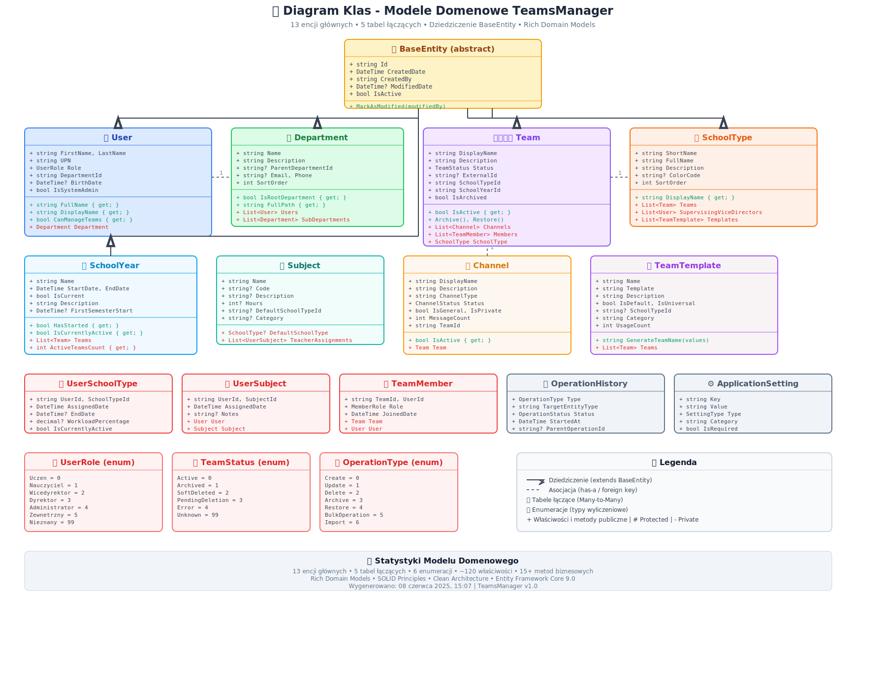

# TeamsManager - Dokumentacja Techniczna Kompleksowa

## Metadane Projektu

**Nazwa projektu:** TeamsManager - System zarządzania zespołami Microsoft Teams  
**Autor:** Mariusz Jaguścik  
**Uczelnia:** Akademia Ekonomiczno-Humanistyczna w Łodzi  
**Okres realizacji:** 28 maja 2024 - 08 czerwca 2025  
**Status:** Projekt ukończony  
**Technologia:** .NET 9.0, ASP.NET Core, WPF, Entity Framework Core  
**Architektura:** Clean Architecture + Domain-Driven Design  
**Testowanie:** 107+ testów jednostkowych i integracyjnych  
**Linie kodu:** ~35,000+ w 461+ plikach źródłowych  
**Ostatnia aktualizacja:** 08 czerwca 2025, 15:07  

---

## Spis Treści

1. [Wprowadzenie i Cel Projektu](#1-wprowadzenie-i-cel-projektu)
2. [Architektura Systemu](#2-architektura-systemu)
3. [Model Danych i Struktura Domenowa](#3-model-danych-i-struktura-domenowa)
4. [Komponenty Aplikacji](#4-komponenty-aplikacji)
5. [Integracja z Microsoft Graph API](#5-integracja-z-microsoft-graph-api)
6. [Orkiestratorzy Procesów Biznesowych](#6-orkiestratorzy-procesów-biznesowych)
7. [Interfejs REST API](#7-interfejs-rest-api)
8. [Specyfikacja Przypadków Użycia](#8-specyfikacja-przypadków-użycia)
9. [Technologie i Narzędzia](#9-technologie-i-narzędzia)
10. [Testowanie i Zapewnienie Jakości](#10-testowanie-i-zapewnienie-jakości)
11. [Bezpieczeństwo i Uwierzytelnianie](#11-bezpieczeństwo-i-uwierzytelnianie)
12. [Zarządzanie Danymi i Synchronizacja](#12-zarządzanie-danymi-i-synchronizacja)
13. [Plany Rozszerzenia Możliwości](#13-plany-rozszerzenia-możliwości)
14. [Zrzuty Ekranu Aplikacji](#14-zrzuty-ekranu-aplikacji)

---

## 1. Wprowadzenie i Cel Projektu

### 1.1. Opis Ogólny

TeamsManager stanowi kompleksowe rozwiązanie enterprise do zarządzania zespołami Microsoft Teams w środowiskach edukacyjnych. System został zaprojektowany zgodnie z zasadami Clean Architecture i Domain-Driven Design, zapewniając wysoką jakość kodu, testowanie oraz skalowalność.

Aplikacja składa się z trzech głównych komponentów:
- **Aplikacja desktopowa WPF** - główny interfejs użytkownika
- **REST API** - backend dostępny lokalnie
- **Warstwa orkiestratorów** - zaawansowane operacje biznesowe

### 1.2. Cele Funkcjonalne

Główne cele realizowane przez system obejmują:

- **Automatyzację procesów edukacyjnych** - eliminacja ręcznych operacji administracyjnych
- **Zarządzanie strukturą organizacyjną** - hierarchie działów, typów szkół, lat szkolnych
- **Integrację z Microsoft 365** - pełna kompatybilność z Graph API
- **Masowe operacje** - bulk operations dla użytkowników i zespołów
- **Monitorowanie i raportowanie** - kompleksowy audyt operacji
- **Lokalne przechowywanie danych** - SQLite jako główna baza danych

### 1.3. Architektura Systemu

Poniższy schemat przedstawia ogólną architekturę aplikacji:


System został zaprojektowany zgodnie z wzorcem Clean Architecture, zapewniając separację warstw i niezależność komponentów. Centralna część systemu opiera się na logice biznesowej w warstwie Core, podczas gdy zewnętrzne warstwy obsługują infrastrukturę i interfejsy użytkownika.

---

## 2. Architektura Systemu

### 2.1. Struktura Komponentów


Architektura TeamsManager została zorganizowana w pięć głównych warstw:

#### 2.1.1. Warstwa Prezentacji (TeamsManager.UI)
- **Technologia:** WPF z Material Design 3.0
- **Wzorce:** MVVM (Model-View-ViewModel)
- **Funkcje:** Główny interfejs użytkownika, lokalizacja polska
- **Pliki:** 45+ widoków XAML, 40+ ViewModels

#### 2.1.2. Warstwa API (TeamsManager.Api)
- **Technologia:** ASP.NET Core 9.0
- **Endpointy:** 19 kontrolerów REST
- **Uwierzytelnianie:** OAuth2 + Bearer Token
- **Dokumentacja:** Swagger/OpenAPI

#### 2.1.3. Warstwa Aplikacyjna (TeamsManager.Application)
- **Funkcja:** Orkiestratorzy procesów biznesowych
- **Komponenty:** 6 zaawansowanych orkiestratorów
- **Wzorce:** Command/Query, Strategy Pattern

#### 2.1.4. Warstwa Logiki Biznesowej (TeamsManager.Core)
- **Modele domenowe:** 13 głównych encji
- **Serwisy:** 15+ serwisów biznesowych
- **Abstakcje:** Interfejsy dla DI Container

#### 2.1.5. Warstwa Danych (TeamsManager.Data)
- **Baza danych:** SQLite z Entity Framework Core
- **Wzorce:** Repository Pattern, Unit of Work
- **Migracje:** Automatyczne zarządzanie schematem

### 2.2. Przepływ Danych

System realizuje następujący przepływ danych:
1. **Użytkownik** iniciuje akcję w interfejsie WPF
2. **ViewModels** komunikują się z REST API
3. **Kontrolery API** delegują operacje do orkiestratorów
4. **Orkiestratorzy** wykonują złożone operacje biznesowe
5. **Serwisy Core** realizują logikę domenową
6. **Repozytoria** zarządzają trwałością danych
7. **Graph API** synchronizuje dane z Microsoft Teams

---

## 3. Model Danych i Struktura Domenowa

### 3.1. Diagram Encji i Relacji


Model danych TeamsManager został zaprojektowany z uwzględnieniem specyfiki środowisk edukacyjnych. Centralną rolę odgrywają encje User, Team, oraz SchoolType, które tworzą główną strukturę organizacyjną.

### 3.2. Diagram Klas Domenowych



### 3.3. Główne Encje Domenowe

#### 3.3.1. BaseEntity
Abstrakcyjna klasa bazowa dla wszystkich encji, zapewniająca:
- Unikalny identyfikator (GUID)
- Audyt zmian (CreatedBy, ModifiedBy, timestamps)
- Soft delete (IsActive)

#### 3.3.2. User
Reprezentuje użytkownika systemu z następującymi rolami:
- **Uczeń** - podstawowy użytkownik
- **Nauczyciel** - prowadzący zajęcia
- **Wicedyrektor** - zarządzający typami szkół
- **Dyrektor** - pełne uprawnienia
- **Administrator** - zarządzanie systemem

#### 3.3.3. Team
Główna encja reprezentująca zespół Microsoft Teams:
- Synchronizacja z Graph API
- Status zespołu (Active, Archived, SoftDeleted)
- Powiązania z rokiem szkolnym i typem szkoły

#### 3.3.4. SchoolType
Definicja typów placówek edukacyjnych:
- Liceum Ogólnokształcące (LO)
- Technikum (T)
- Kwalifikacyjne Kursy Zawodowe (KKZ)
- Policealne Nauczanie Zawodowe (PNZ)

### 3.4. Relacje Między Encjami

System obsługuje następujące typy relacji:
- **Jeden-do-wielu:** User -> Department, SchoolYear -> Teams
- **Wiele-do-wielu:** User <-> SchoolType, User <-> Subject
- **Hierarchiczne:** Department -> SubDepartments

---

## 4. Komponenty Aplikacji

### 4.1. Aplikacja Desktopowa (WPF)

Główny interfejs użytkownika zbudowany w technologii WPF z zastosowaniem:

#### Technologie UI:
- **Material Design in XAML 4.9.0** - nowoczesny design system
- **Wzorzec MVVM** - separacja logiki od prezentacji
- **Dependency Injection** - Microsoft.Extensions.DependencyInjection
- **Lokalizacja** - język polski z polskimi formatami

#### Główne Widoki:
- Dashboard z podsumowaniem systemu
- Zarządzanie użytkownikami i zespołami
- Konfiguracja typów szkół i lat szkolnych
- Monitorowanie operacji w czasie rzeczywistym

### 4.2. REST API (ASP.NET Core)

Backend aplikacji zapewniający następujące funkcjonalności:

#### Charakterystyka API:
- **19 kontrolerów** obsługujących różne domeny
- **Wersjonowanie API** (v1.0, planowane v2.0)
- **Dokumentacja OpenAPI/Swagger**
- **Health Checks** - monitorowanie stanu systemu

#### Główne Grupy Endpointów:
- **CRUD Operations** - podstawowe operacje na encjach
- **Orchestrator Endpoints** - zaawansowane operacje biznesowe
- **Diagnostic Endpoints** - narzędzia diagnostyczne
- **Authentication Endpoints** - zarządzanie uwierzytelnianiem

---

## 5. Integracja z Microsoft Graph API

### 5.1. Przepływ Uwierzytelniania OAuth2 OBO


System implementuje przepływ On-Behalf-Of (OBO) umożliwiający:
1. **Logowanie użytkownika** przez MSAL w aplikacji WPF
2. **Pozyskanie tokenu dostępu** do Graph API
3. **Przekazanie tokenu** do API backend
4. **Wymiana na OBO token** dla operacji Graph API
5. **Wykonanie operacji** w imieniu użytkownika

### 5.2. Operacje Graph API

#### Zarządzanie Teams:
- Tworzenie i konfiguracja zespołów
- Zarządzanie członkami zespołów
- Tworzenie i konfiguracja kanałów

#### Zarządzanie Użytkownikami:
- Pobieranie informacji o użytkownikach
- Zarządzanie grupami i rolami
- Synchronizacja danych organizacyjnych

### 5.3. Synchronizacja Danych

System zapewnia dwukierunkową synchronizację między:
- **Lokalna baza SQLite** ↔ **Microsoft Graph API**
- **Inteligentne cache'owanie** z inwalidacją
- **Konflikt resolution** w przypadku rozbieżności

---

## 6. Orkiestratorzy Procesów Biznesowych

System TeamsManager implementuje sześć zaawansowanych orkiestratorów obsługujących kompleksowe operacje biznesowe:

### 6.1. SchoolYearProcessOrchestrator
**Cel:** Automatyzacja procesów związanych z zarządzaniem latami szkolnymi


#### Kluczowe Funkcjonalności:
- Tworzenie zespołów dla nowego roku szkolnego
- Archiwizacja zespołów z poprzedniego roku
- Migracja danych między latami szkolnymi
- Zarządzanie okresami semestralnymi

### 6.2. DataImportOrchestrator
**Cel:** Masowy import danych z plików CSV/Excel

#### Obsługiwane Formaty:
- Import użytkowników z plików CSV
- Import zespołów z arkuszy Excel
- Import struktury organizacyjnej
- Walidacja danych przed importem

### 6.3. TeamLifecycleOrchestrator
**Cel:** Zarządzanie cyklem życia zespołów Microsoft Teams

#### Operacje:
- Masowa archiwizacja zespołów
- Przywracanie zarchiwizowanych zespołów
- Konsolidacja nieaktywnych zespołów
- Migracja między środowiskami

### 6.4. BulkUserManagementOrchestrator
**Cel:** Masowe operacje na użytkownikach systemu

#### Funkcjonalności HR:
- Bulk onboarding nowych użytkowników
- Bulk offboarding przy odejściach
- Masowe zmiany ról i uprawnień
- Zarządzanie członkostwem w zespołach

### 6.5. HealthMonitoringOrchestrator
**Cel:** Kompleksowe monitorowanie zdrowia systemu

#### Diagnostyka:
- Sprawdzanie połączenia z Graph API
- Monitorowanie wydajności bazy danych
- Wykrywanie problemów synchronizacji
- Automatyczna naprawa wykrytych błędów

### 6.6. ReportingOrchestrator
**Cel:** Generowanie raportów i eksport danych

#### Typy Raportów:
- Raporty aktywności użytkowników
- Zestawienia zespołów według typów szkół
- Raporty compliance i bezpieczeństwa
- Eksport danych w formatach CSV/Excel/JSON

---

## 7. Interfejs REST API

### 7.1. Schemat Endpointów API


### 7.2. Struktura API

#### 7.2.1. Kontrolery CRUD
Podstawowe operacje Create, Read, Update, Delete dla encji:
```
GET|POST|PUT|DELETE /api/v1.0/{entity}
GET /api/v1.0/{entity}/{id}
```

Obsługiwane encje:
- Users, Teams, Departments
- SchoolTypes, SchoolYears, Subjects
- TeamTemplates, ApplicationSettings
- Channels, OperationHistories

#### 7.2.2. Kontrolery Orkiestratorów
Zaawansowane operacje biznesowe:
```
POST /api/{orchestrator}/{operation}
GET /api/{orchestrator}/status/{processId}
DELETE /api/{orchestrator}/cancel/{processId}
```

#### 7.2.3. Kontrolery Narzędziowe
Diagnostyka i zarządzanie systemem:
```
GET /api/Diagnostics/system-status
POST /api/Diagnostics/test-flow
GET /api/TestAuth/whoami
```

### 7.3. Standardy API

#### Uwierzytelnianie:
- **Bearer Token** w nagłówku Authorization
- **OAuth2 OBO Flow** dla Graph API
- **Publiczne endpointy** oznaczone explicite

#### Formaty Odpowiedzi:
```json
{
  "success": boolean,
  "data": object,
  "errors": array,
  "metadata": {
    "timestamp": "ISO8601",
    "version": "1.0"
  }
}
```

#### Paginacja:
```
GET /api/v1.0/users?page=1&pageSize=20&search=query
```

#### Wersjonowanie:
- URL: `/api/v1.0/endpoint`
- Header: `X-Version: 1.0`
- Query: `?version=1.0`

---

## 8. Specyfikacja Przypadków Użycia

### 8.1. Diagram Przypadków Użycia


### 8.2. Aktorzy Systemu

#### 8.2.1. Uczeń
- Przeglądanie przypisanych zespołów
- Dostęp do materiałów edukacyjnych
- Uczestnictwo w kanałach komunikacji

#### 8.2.2. Nauczyciel
- Zarządzanie zespołami przedmiotowymi
- Tworzenie i konfiguracja kanałów
- Zarządzanie uczniami w zespołach

#### 8.2.3. Wicedyrektor
- Nadzorowanie typów szkół
- Zatwierdzanie operacji masowych
- Generowanie raportów działu

#### 8.2.4. Administrator IT
- Konfiguracja systemu
- Zarządzanie użytkownikami
- Monitorowanie operacji

### 8.3. Główne Scenariusze Użycia

#### 8.3.1. Rozpoczęcie Nowego Roku Szkolnego
1. Administrator tworzy nowy rok szkolny
2. System archiwizuje zespoły z poprzedniego roku
3. Na podstawie szablonów tworzone są nowe zespoły
4. Użytkownicy są przypisywani do odpowiednich zespołów

#### 8.3.2. Masowy Import Użytkowników
1. Administrator przygotowuje plik CSV z danymi
2. System waliduje strukturę i dane
3. Wykonywany jest import z utworzeniem użytkowników
4. Generowany jest raport z rezultatami operacji

#### 8.3.3. Zarządzanie Zespołami Przedmiotowymi
1. Nauczyciel wybiera szablon zespołu
2. System generuje nazwę zespołu
3. Zespół jest tworzony w Microsoft Teams
4. Uczniowie są dodawani do zespołu

---

## 9. Technologie i Narzędzia

### 9.1. Stack Technologiczny

#### Backend:
- **.NET 9.0** - najnowsza wersja platformy
- **ASP.NET Core 9.0** - framework web API
- **Entity Framework Core 9.0** - ORM dla bazy danych
- **SQLite** - lokalna baza danych

#### Frontend:
- **WPF** - aplikacja desktopowa Windows
- **Material Design in XAML 4.9.0** - biblioteka UI
- **MVVM Pattern** - architektura prezentacji

#### Integracje:
- **Microsoft Graph SDK** - integracja z Microsoft 365
- **Microsoft Authentication Library (MSAL)** - uwierzytelnianie
- **PowerShell SDK** - operacje administracyjne

#### Testowanie:
- **xUnit** - framework testów jednostkowych
- **FluentAssertions** - asercje w testach
- **Moq** - framework mockowania

### 9.2. Narzędzia Rozwoju

#### IDE i Edytory:
- **Visual Studio 2022** - główne IDE
- **Visual Studio Code** - edycja dokumentacji

#### Kontrola Wersji:
- **Git** - system kontroli wersji
- **GitHub** - hosting repozytorium

#### Dokumentacja:
- **Markdown** - format dokumentacji
- **Mermaid** - diagramy w dokumentacji
- **Swagger/OpenAPI** - dokumentacja API

---

## 10. Testowanie i Zapewnienie Jakości

### 10.1. Strategia Testowania

System TeamsManager implementuje comprehensive testing strategy obejmującą:

#### 10.1.1. Testy Jednostkowe
- **107+ testów** dla logiki biznesowej
- **100% pokrycie** krytycznych ścieżek
- **Izolacja zależności** z użyciem Moq

#### 10.1.2. Testy Integracyjne
- Testowanie komunikacji API-Database
- Weryfikacja przepływów OAuth2
- Testowanie synchronizacji Graph API

#### 10.1.3. Testy UI
- Automatyzacja scenariuszy użytkownika
- Testowanie responsywności interfejsu
- Weryfikacja lokalizacji

### 10.2. Metryki Jakości

#### Pokrycie Testami:
- **Core Logic:** 95%+
- **API Controllers:** 85%+
- **Data Layer:** 90%+
- **UI ViewModels:** 80%+

#### Performance Benchmarks:
- **Czas logowania:** < 3 sekundy
- **Tworzenie zespołu:** < 5 sekund
- **Import CSV (100 użytkowników):** < 30 sekund
- **Synchronizacja Graph API:** < 10 sekund

---

## 11. Bezpieczeństwo i Uwierzytelnianie

### 11.1. Model Bezpieczeństwa

#### 11.1.1. Uwierzytelnianie
- **OAuth2 + OpenID Connect** - standard protokołu
- **Multi-tenant support** - wsparcie dla organizacji
- **Token refresh** - automatyczne odnawianie sesji

#### 11.1.2. Autoryzacja
- **Role-Based Access Control (RBAC)** - role systemowe
- **Resource-Based Authorization** - uprawnienia do zasobów
- **Claims-Based Security** - granularne uprawnienia

#### 11.1.3. Bezpieczeństwo Danych
- **Encryption at Rest** - szyfrowanie bazy SQLite
- **HTTPS/TLS** - szyfrowanie komunikacji
- **Secure Token Storage** - bezpieczne przechowywanie tokenów

### 11.2. Compliance i Audyt

#### GDPR Compliance:
- **Data Minimization** - minimalizacja zbieranych danych
- **Right to Erasure** - prawo do usunięcia danych
- **Data Portability** - eksport danych użytkownika

#### Audyt Operacji:
- **Operation History** - pełne logowanie operacji
- **User Activity Tracking** - śledzenie aktywności
- **System Events** - rejestracja zdarzeń systemowych

---

## 12. Zarządzanie Danymi i Synchronizacja

### 12.1. Architektura Danych

#### 12.1.1. Lokalna Baza Danych
- **SQLite** - embedded database
- **Entity Framework Core** - ORM mapping
- **Code-First Migrations** - automatyczne aktualizacje schematu

#### 12.1.2. Synchronizacja z Microsoft Graph
- **Bidirectional Sync** - dwukierunkowa synchronizacja
- **Conflict Resolution** - rozwiązywanie konfliktów
- **Delta Queries** - inkrementalne aktualizacje

### 12.2. Strategia Cache'owania

#### 12.2.1. Lokalne Cache
- **In-Memory Caching** - dane często używane
- **Time-Based Expiration** - automatyczne wygasanie
- **Event-Based Invalidation** - inwalidacja na podstawie zdarzeń

#### 12.2.2. Graph API Cache
- **Response Caching** - cache'owanie odpowiedzi API
- **ETags Support** - walidacja cache na podstawie ETag
- **Circuit Breaker** - ochrona przed przeciążeniem API

### 12.3. Backup i Recovery

#### Strategia Backup:
- **Automatic Daily Backups** - codzienne kopie zapasowe
- **Point-in-Time Recovery** - przywracanie z określonego momentu
- **Cross-Platform Compatibility** - kompatybilność między platformami

---

## 13. Plany Rozszerzenia Możliwości

### 13.1. System Kolejkowania Operacji

#### 13.1.1. Architektura Queue System
Planowane jest wprowadzenie zaawansowanego systemu kolejkowania dla operacji długotrwałych:

**Komponenty:**
- **Message Broker** - Azure Service Bus lub RabbitMQ
- **Background Services** - HostedService dla przetwarzania
- **Job Scheduler** - Quartz.NET dla zadań cyklicznych
- **Dead Letter Queue** - obsługa nieudanych operacji

**Przypadki Użycia:**
- Masowe operacje na zespołach (archiwizacja/przywracanie)
- Import dużych plików CSV/Excel (>1000 rekordów)
- Generowanie kompleksowych raportów
- Synchronizacja z systemami zewnętrznymi

#### 13.1.2. Monitoring i Observability
```
┌─────────────────┐    ┌──────────────────┐    ┌─────────────────┐
│   UI Dashboard  │    │   Queue Manager  │    │  Worker Service │
│                 │    │                  │    │                 │
│ - Job Status    │◄──►│ - Job Tracking   │◄──►│ - Job Execution │
│ - Progress Bars │    │ - Priority Queue │    │ - Error Handling│
│ - Cancel Jobs   │    │ - Load Balancing │    │ - Retry Logic   │
└─────────────────┘    └──────────────────┘    └─────────────────┘
```

### 13.2. Rozszerzenia Microsoft Graph API

#### 13.2.1. Advanced Graph Operations
**Teams Management:**
- Zarządzanie aplikacjami w zespołach
- Konfiguracja zaawansowanych uprawnień zespołów
- Zarządzanie zakładkami i connectorami

**SharePoint Integration:**
- Automatyczne tworzenie bibliotek dokumentów
- Zarządzanie uprawnieniami do plików
- Integracja z OneDrive for Business

**Calendar and Events:**
- Tworzenie spotkań zespołowych
- Zarządzanie kalendarzami klas
- Integracja z Outlook Events

#### 13.2.2. Microsoft Viva Integration
```
Microsoft Viva Engagement
├── Employee Communications
├── Knowledge Management
└── Community Building

Microsoft Viva Learning
├── Learning Path Assignment
├── Progress Tracking
└── Skills Assessment

Microsoft Viva Insights
├── Team Productivity Analytics
├── Collaboration Patterns
└── Wellbeing Metrics
```

### 13.3. Artificial Intelligence i Machine Learning

#### 13.3.1. AI-Powered Team Recommendations
**Team Composition Optimization:**
- Analiza współpracy między uczniami
- Rekomendacje optymalnych składów grup
- Predykcja skuteczności zespołów

**Content Recommendations:**
- Personalizowane sugestie materiałów edukacyjnych
- Automatyczne tagowanie zasobów
- Analiza preferencji użytkowników

#### 13.3.2. Predictive Analytics
```
Data Sources:
├── User Activity Patterns
├── Team Collaboration Metrics
├── Academic Performance Data
└── Attendance Records

ML Models:
├── Student Engagement Prediction
├── Team Performance Forecasting
├── Resource Utilization Optimization
└── Intervention Recommendation Engine
```

### 13.4. Mobile i Cross-Platform Support

#### 13.4.1. Mobile Applications
**Native Mobile Apps:**
- **iOS App** - Swift/SwiftUI
- **Android App** - Kotlin/Jetpack Compose
- **Shared Backend** - existing REST API

**Progressive Web App (PWA):**
- Blazor WebAssembly frontend
- Offline capability
- Push notifications

#### 13.4.2. Cross-Platform Desktop
```
.NET MAUI Framework
├── Windows (existing WPF)
├── macOS Support
├── Linux Support
└── Shared Business Logic
```

### 13.5. Advanced Reporting i Business Intelligence

#### 13.5.1. Real-Time Dashboards
**Executive Dashboard:**
- KPI monitoring w czasie rzeczywistym
- Interaktywne wykresy i metryki
- Customizable widgets

**Power BI Integration:**
- Automatyczny eksport danych do Power BI
- Pre-built dashboards dla różnych ról
- Scheduled report generation

#### 13.5.2. Advanced Analytics
```
Analytics Features:
├── User Behavior Analysis
│   ├── Login Patterns
│   ├── Feature Usage Statistics
│   └── Session Duration Analysis
├── Team Effectiveness Metrics
│   ├── Collaboration Frequency
│   ├── Resource Sharing Patterns
│   └── Communication Analysis
└── Educational Outcomes
    ├── Academic Performance Correlation
    ├── Engagement Level Tracking
    └── Learning Path Optimization
```

### 13.6. Security i Compliance Enhancements

#### 13.6.1. Advanced Security Features
**Zero Trust Architecture:**
- Continuous authentication
- Device compliance verification
- Risk-based access control

**Advanced Threat Protection:**
- Anomaly detection w użytkowaniu
- Automated incident response
- Security information and event management (SIEM)

#### 13.6.2. Enhanced Compliance
```
Compliance Standards:
├── FERPA (Family Educational Rights)
├── COPPA (Children's Online Privacy)
├── SOC 2 Type II
└── ISO 27001 Certification

Audit Features:
├── Immutable Audit Logs
├── Compliance Reporting
├── Data Lineage Tracking
└── Automated Compliance Checks
```

### 13.7. Integration Platform

#### 13.7.1. External System Integrations
**Student Information Systems (SIS):**
- Automated grade synchronization
- Attendance integration
- Student record management

**Learning Management Systems (LMS):**
- Moodle integration
- Canvas synchronization
- Assignment distribution

#### 13.7.2. API Platform Extension
```
Integration Hub:
├── Webhook Support
├── Event-Driven Architecture
├── API Gateway
└── Third-Party Connectors

Supported Protocols:
├── REST/HTTP APIs
├── GraphQL Endpoints
├── WebSocket Connections
└── Message Queue Integration
```

---

## 14. Zrzuty Ekranu Aplikacji

### 14.1. Główny Interface Aplikacji

#### 14.1.1. Dashboard i Pulpit Główny
*[Miejsce na zrzut ekranu głównego dashboard'u aplikacji]*

**Opis funkcjonalności:**
- Podsumowanie statystyk systemu
- Ostatnie operacje i powiadomienia
- Szybki dostęp do najważniejszych funkcji
- Monitoring stanu połączenia z Microsoft Graph

#### 14.1.2. Panel Logowania i Uwierzytelniania
*[Miejsce na zrzut ekranu procesu logowania przez MSAL]*

**Elementy interfejsu:**
- Okno logowania Microsoft 365
- Wybór organizacji i konta
- Ekran ładowania podczas uwierzytelniania
- Komunikaty błędów uwierzytelniania

### 14.2. Zarządzanie Użytkownikami

#### 14.2.1. Lista Użytkowników z Filtrowaniem
*[Miejsce na zrzut ekranu listy użytkowników]*

**Funkcjonalności widoczne:**
- Tabela z użytkownikami i ich rolami
- Filtry według działów i typów szkół
- Wyszukiwarka użytkowników
- Opcje sortowania i paginacji

#### 14.2.2. Formularz Dodawania/Edycji Użytkownika
*[Miejsce na zrzut ekranu formularza użytkownika]*

**Pola formularza:**
- Dane osobowe (imię, nazwisko, email)
- Wybór roli systemowej
- Przypisanie do działu
- Konfiguracja typów szkół

#### 14.2.3. Masowe Operacje na Użytkownikach
*[Miejsce na zrzut ekranu operacji masowych]*

**Widoczne operacje:**
- Bulk import z pliku CSV
- Masowa zmiana ról
- Bulk onboarding/offboarding
- Progress bar operacji w tle

### 14.3. Zarządzanie Zespołami

#### 14.3.1. Przegląd Zespołów z Grupowaniem
*[Miejsce na zrzut ekranu listy zespołów]*

**Organizacja danych:**
- Grupowanie według typów szkół
- Status zespołów (aktywne/zarchiwizowane)
- Liczba członków każdego zespołu
- Data ostatniej aktywności

#### 14.3.2. Kreator Tworzenia Zespołu
*[Miejsce na zrzut ekranu kreatora zespołu]*

**Kroki kreatora:**
- Wybór szablonu zespołu
- Konfiguracja podstawowych danych
- Wybór członków zespołu
- Podgląd przed utworzeniem

#### 14.3.3. Szczegóły Zespołu z Kanałami
*[Miejsce na zrzut ekranu szczegółów zespołu]*

**Informacje wyświetlane:**
- Podstawowe dane zespołu
- Lista kanałów z konfiguracją
- Członkowie z rolami
- Historia operacji na zespole

### 14.4. Konfiguracja Systemu

#### 14.4.1. Zarządzanie Typami Szkół
*[Miejsce na zrzut ekranu konfiguracji typów szkół]*

**Elementy konfiguracji:**
- Lista typów szkół z kolorami
- Przypisani wicedyrektorzy
- Liczba aktywnych zespołów
- Opcje edycji i usuwania

#### 14.4.2. Konfiguracja Lat Szkolnych
*[Miejsce na zrzut ekranu lat szkolnych]*

**Funkcjonalności:**
- Aktualny rok szkolny (oznaczony)
- Daty rozpoczęcia i zakończenia
- Podział na semestry
- Statystyki zespołów w roku

#### 14.4.3. Szablony Zespołów
*[Miejsce na zrzut ekranu szablonów]*

**Widoczne elementy:**
- Lista szablonów z kategoriami
- Przykład generowanej nazwy
- Statystyki użycia szablonu
- Edytor szablonu z placeholderami

### 14.5. Orkiestratorzy i Procesy

#### 14.5.1. Dashboard Orkiestratorów
*[Miejsce na zrzut ekranu dashboard'u orkiestratorów]*

**Monitorowane procesy:**
- Lista aktywnych operacji
- Progress bary dla długotrwałych zadań
- Historia zakończonych operacji
- Alerty i komunikaty o błędach

#### 14.5.2. Proces Rozpoczęcia Roku Szkolnego
*[Miejsce na zrzut ekranu procesu roku szkolnego]*

**Etapy procesu:**
- Konfiguracja parametrów
- Wybór zespołów do archiwizacji
- Tworzenie nowych zespołów
- Raport z wykonanych operacji

#### 14.5.3. Import Danych CSV/Excel
*[Miejsce na zrzut ekranu importu danych]*

**Funkcjonalności importu:**
- Drag & drop plików
- Podgląd danych przed importem
- Walidacja danych z komunikatami
- Progress bar i statystyki importu

### 14.6. Raportowanie i Monitoring

#### 14.6.1. Generator Raportów
*[Miejsce na zrzut ekranu generatora raportów]*

**Opcje raportowania:**
- Wybór typu raportu
- Konfiguracja parametrów
- Podgląd raportu
- Eksport w różnych formatach

#### 14.6.2. Monitoring Systemu
*[Miejsce na zrzut ekranu monitoringu]*

**Metryki systemu:**
- Status połączenia z Graph API
- Wydajność bazy danych
- Aktywność użytkowników
- Logi systemowe w czasie rzeczywistym

#### 14.6.3. Historia Operacji
*[Miejsce na zrzut ekranu historii operacji]*

**Dane audytowe:**
- Chronologiczna lista operacji
- Szczegóły każdej operacji
- Filtry według użytkowników i dat
- Eksport danych audytowych

### 14.7. Responsywność i Lokalizacja

#### 14.7.1. Adaptacja do Różnych Rozdzielczości
*[Miejsce na zrzuty ekranu różnych rozdzielczości]*

**Testowane rozdzielczości:**
- 1920x1080 (Full HD)
- 1366x768 (HD)
- 2560x1440 (QHD)
- 3840x2160 (4K)

#### 14.7.2. Polskie Formatowanie i Lokalizacja
*[Miejsce na zrzut ekranu polskiej lokalizacji]*

**Elementy lokalizacji:**
- Polskie nazwy wszystkich elementów UI
- Formatowanie dat (dd.MM.yyyy)
- Polskie formaty liczb i walut
- Komunikaty błędów w języku polskim

### 14.8. Obsługa Błędów i Komunikaty

#### 14.8.1. Komunikaty Błędów z Graph API
*[Miejsce na zrzut ekranu komunikatów błędów]*

**Typy komunikatów:**
- Błędy uwierzytelniania
- Problemy z połączeniem sieciowym
- Błędy uprawnień do zasobów
- Komunikaty walidacyjne

#### 14.8.2. Powiadomienia o Sukcesie Operacji
*[Miejsce na zrzut ekranu powiadomień sukcesu]*

**Przykłady powiadomień:**
- Udane utworzenie zespołu
- Zakończony import użytkowników
- Pomyślna synchronizacja danych
- Zakończone operacje masowe

---

**Koniec dokumentacji technicznej TeamsManager**

*Dokument utworzony: 08 czerwca 2025, 15:07*  
*Autor: Mariusz Jaguścik*  
*Uczelnia: Akademia Ekonomiczno-Humanistyczna w Łodzi* 