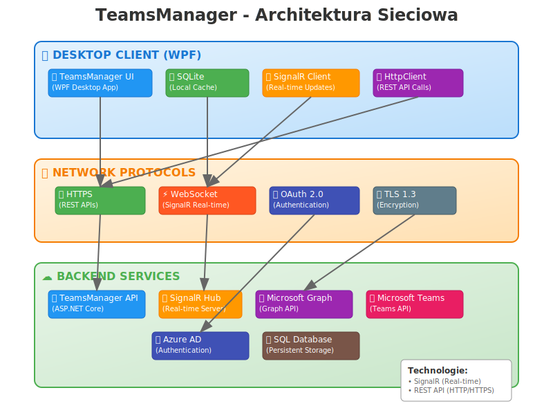

# TeamsManager - Architektura Sieciowa

## 📊 Diagram architektury



## 🏗️ Opis warstw

### 🖥️ **Desktop Client (WPF)**
- **TeamsManager UI** - główna aplikacja desktopowa WPF
- **SQLite** - lokalna cache baza danych 
- **SignalR Client** - klient do komunikacji real-time
- **HttpClient** - klient HTTP do REST API

### 🌐 **Network Protocols**
- **HTTPS** - szyfrowany transport dla REST API
- **WebSocket** - bidirectional communication dla SignalR
- **OAuth 2.0** - protokół autoryzacji 
- **TLS 1.3** - szyfrowanie warstwy transportowej

### ☁️ **Backend Services**
- **TeamsManager API** - własne REST API (ASP.NET Core)
- **SignalR Hub** - server dla real-time komunikacji
- **Microsoft Graph API** - dostęp do danych M365
- **Microsoft Teams API** - zarządzanie zespołami Teams
- **Azure AD** - uwierzytelnianie i autoryzacja
- **SQL Database** - persistentne przechowywanie danych

## 🔄 **Przepływ danych**

### REST API Communication
```
WPF UI → HttpClient → HTTPS → TeamsManager API → Microsoft Graph/Teams
```

### Real-time Updates  
```
SignalR Hub → WebSocket → SignalR Client → WPF UI (Observable Streams)
```

### Authentication Flow
```
WPF UI → OAuth 2.0 → Azure AD → JWT Token → API Authorization
```

## 🛡️ **Bezpieczeństwo**

- ✅ **End-to-End TLS** - wszystkie połączenia szyfrowane
- ✅ **OAuth 2.0 + JWT** - bezpieczna autoryzacja
- ✅ **Token-based Auth** - dla SignalR i REST API
- ✅ **HTTPS Only** - wymuszony secure transport

## ⚡ **Wydajność i odporność**

- 🔄 **Auto-reconnect** - SignalR automatycznie się łączy
- 🛡️ **Circuit Breaker** - zabezpieczenie przed przeciążeniem
- 🔄 **Retry Policies** - automatyczne ponawianie żądań
- 💾 **Local Caching** - SQLite cache dla offline access
- 📊 **Connection Pooling** - efektywne zarządzanie połączeniami

## 🚀 **Technologie wykorzystane**

| Warstwa | Technologie |
|---------|-------------|
| **Client** | WPF, SignalR.Client, HttpClient, SQLite |
| **Network** | WebSocket, HTTPS, OAuth 2.0, TLS 1.3 |
| **Server** | ASP.NET Core, SignalR Hub, Microsoft Graph |

## 📈 **Zalety architektury**

- 🔄 **Real-time** - natychmiastowe aktualizacje przez SignalR
- 🌐 **RESTful** - standardowe API endpoints 
- 💾 **Offline-capable** - działanie bez internetu (cache)
- 🔐 **Enterprise Security** - Azure AD integration
- ⚡ **High Performance** - asynchroniczne operacje
- 🛡️ **Resilient** - odporność na awarie sieci 