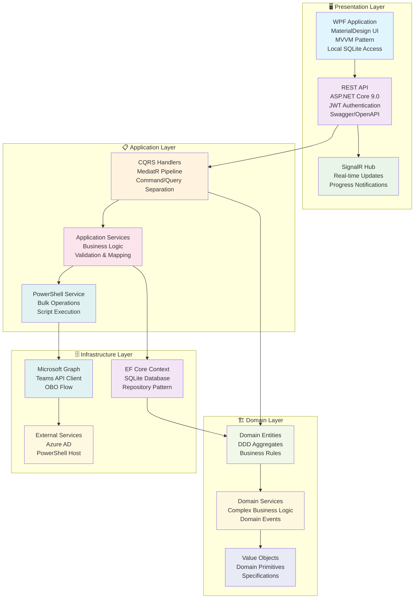

# Architektura Systemu TeamsManager

## Diagram Clean Architecture

## Opis Warstw

### 🖥️ Presentation Layer
- **WPF Application:** Interfejs użytkownika z MaterialDesign, wzorzec MVVM
- **REST API:** ASP.NET Core z JWT authentication i Swagger
- **SignalR Hub:** Komunikacja w czasie rzeczywistym

### 📋 Application Layer  
- **CQRS Handlers:** Rozdzielenie komend i zapytań z MediatR
- **Application Services:** Logika aplikacyjna i walidacja
- **PowerShell Service:** Operacje masowe i skrypty

### 🏗️ Domain Layer
- **Domain Entities:** Agregaty DDD z regułami biznesowymi
- **Domain Services:** Złożona logika domenowa
- **Value Objects:** Obiekty wartości i prymitywy

### 🗄️ Infrastructure Layer
- **EF Core Context:** Dostęp do bazy SQLite z wzorcem Repository
- **Microsoft Graph:** Klient API Teams z przepływem OBO
- **External Services:** Azure AD i hosting PowerShell 