# Architektura Systemu TeamsManager

## Diagram Clean Architecture

```mermaid
graph TD
    subgraph "🖥️ Presentation Layer"
        A["WPF Application<br/>MaterialDesign UI<br/>MVVM Pattern<br/>Local SQLite Access"]
        B["REST API<br/>ASP.NET Core 9.0<br/>JWT Authentication<br/>Swagger/OpenAPI"]
        C["SignalR Hub<br/>Real-time Updates<br/>Progress Notifications"]
    end
    
    subgraph "📋 Application Layer"
        D["CQRS Handlers<br/>MediatR Pipeline<br/>Command/Query Separation"]
        E["Application Services<br/>Business Logic<br/>Validation & Mapping"]
        F["PowerShell Service<br/>Bulk Operations<br/>Script Execution"]
        G1["School Year Orchestrator<br/>Process Management<br/>Bulk Team Operations"]
    end
    
    subgraph "🏗️ Domain Layer"
        G["Domain Entities<br/>DDD Aggregates<br/>Business Rules"]
        H["Domain Services<br/>Complex Business Logic<br/>Domain Events"]
        I["Value Objects<br/>Domain Primitives<br/>Specifications"]
    end
    
    subgraph "🗄️ Infrastructure Layer"
        J["EF Core Context<br/>SQLite Database<br/>Repository Pattern"]
        K["Microsoft Graph<br/>Teams API Client<br/>OBO Flow"]
        L["External Services<br/>Azure AD<br/>PowerShell Host"]
    end
    
    A --> B
    B --> C
    B --> D
    D --> E
    E --> F
    E --> G1
    G1 --> F
    D --> G
    G --> H
    H --> I
    E --> J
    F --> K
    K --> L
    J --> G
    
    style A fill:#e1f5fe
    style B fill:#f3e5f5
    style C fill:#e8f5e8
    style D fill:#fff3e0
    style E fill:#fce4ec
    style F fill:#e0f2f1
    style G fill:#f1f8e9
    style H fill:#fef7e0
    style I fill:#e8eaf6
    style J fill:#f3e5f5
    style K fill:#e0f2f1
    style L fill:#fff8e1
```

## Opis Warstw

### 🖥️ Presentation Layer
- **WPF Application:** Interfejs użytkownika z MaterialDesign, wzorzec MVVM
- **REST API:** ASP.NET Core z JWT authentication i Swagger
- **SignalR Hub:** Komunikacja w czasie rzeczywistym

### 📋 Application Layer  
- **CQRS Handlers:** Rozdzielenie komend i zapytań z MediatR
- **Application Services:** Logika aplikacyjna i walidacja
- **PowerShell Service:** Operacje masowe i skrypty
- **School Year Orchestrator:** Orkiestracja procesów szkolnych i masowe operacje na zespołach

### 🏗️ Domain Layer
- **Domain Entities:** Agregaty DDD z regułami biznesowymi
- **Domain Services:** Złożona logika domenowa
- **Value Objects:** Obiekty wartości i prymitywy

### 🗄️ Infrastructure Layer
- **EF Core Context:** Dostęp do bazy SQLite z wzorcem Repository
- **Microsoft Graph:** Klient API Teams z przepływem OBO
- **External Services:** Azure AD i hosting PowerShell 