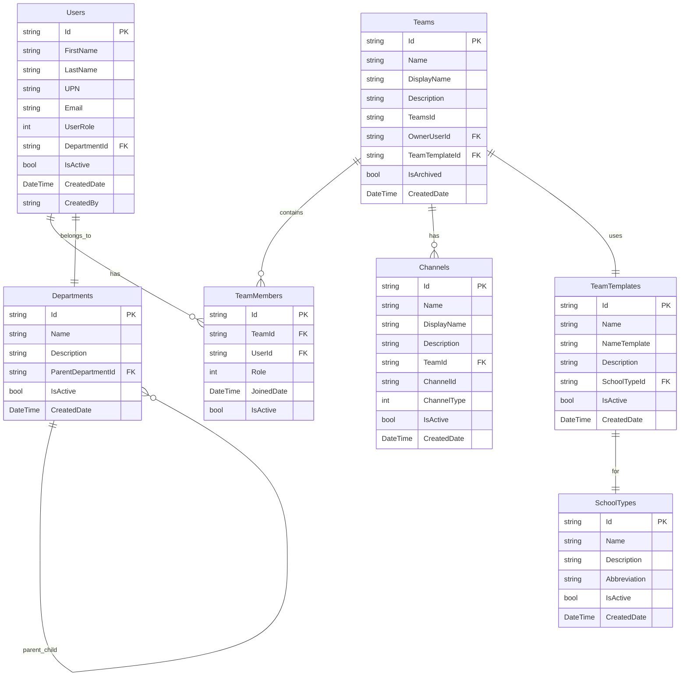

# Model Danych TeamsManager

## Diagram Entity-Relationship

## Opis Encji

### 👥 Users (Użytkownicy)
- **Id**: Unikalny identyfikator użytkownika
- **FirstName/LastName**: Imię i nazwisko
- **UPN**: User Principal Name (Microsoft)
- **UserRole**: Rola użytkownika (enum)
- **DepartmentId**: Przypisanie do działu

### 🏢 Departments (Działy)
- **Id**: Unikalny identyfikator działu
- **Name**: Nazwa działu
- **ParentDepartmentId**: Hierarchia działów
- **Description**: Opis działu

### 👨‍🏫 Teams (Zespoły)
- **Id**: Lokalny identyfikator
- **TeamsId**: Identyfikator w Microsoft Teams
- **OwnerUserId**: Właściciel zespołu
- **TeamTemplateId**: Szablon nazwy zespołu
- **IsArchived**: Status archiwizacji

### 📋 TeamTemplates (Szablony Zespołów)
- **Id**: Unikalny identyfikator szablonu
- **NameTemplate**: Wzorzec nazwy (np. "{SchoolType}-{Subject}-{Year}")
- **SchoolTypeId**: Typ szkoły dla szablonu

### 🎓 SchoolTypes (Typy Szkół)
- **Id**: Unikalny identyfikator typu
- **Name**: Nazwa typu szkoły
- **Abbreviation**: Skrót (np. "SP", "LO")

### 📺 Channels (Kanały)
- **Id**: Lokalny identyfikator kanału
- **ChannelId**: Identyfikator w Microsoft Teams
- **TeamId**: Zespół nadrzędny
- **ChannelType**: Typ kanału (Standard/Private)

### 👥 TeamMembers (Członkowie Zespołów)
- **Id**: Unikalny identyfikator członkostwa
- **TeamId/UserId**: Relacja wiele-do-wielu
- **Role**: Rola w zespole (Owner/Member/Guest)
- **JoinedDate**: Data dołączenia

## Indeksy i Ograniczenia

### Klucze Obce
- `Users.DepartmentId → Departments.Id`
- `Teams.OwnerUserId → Users.Id`
- `Teams.TeamTemplateId → TeamTemplates.Id`
- `TeamTemplates.SchoolTypeId → SchoolTypes.Id`
- `Channels.TeamId → Teams.Id`
- `TeamMembers.TeamId → Teams.Id`
- `TeamMembers.UserId → Users.Id`

### Indeksy Unikalności
- `Users.UPN` (Unique)
- `Teams.TeamsId` (Unique)
- `Channels.ChannelId` (Unique)
- `TeamMembers(TeamId, UserId)` (Composite Unique) 